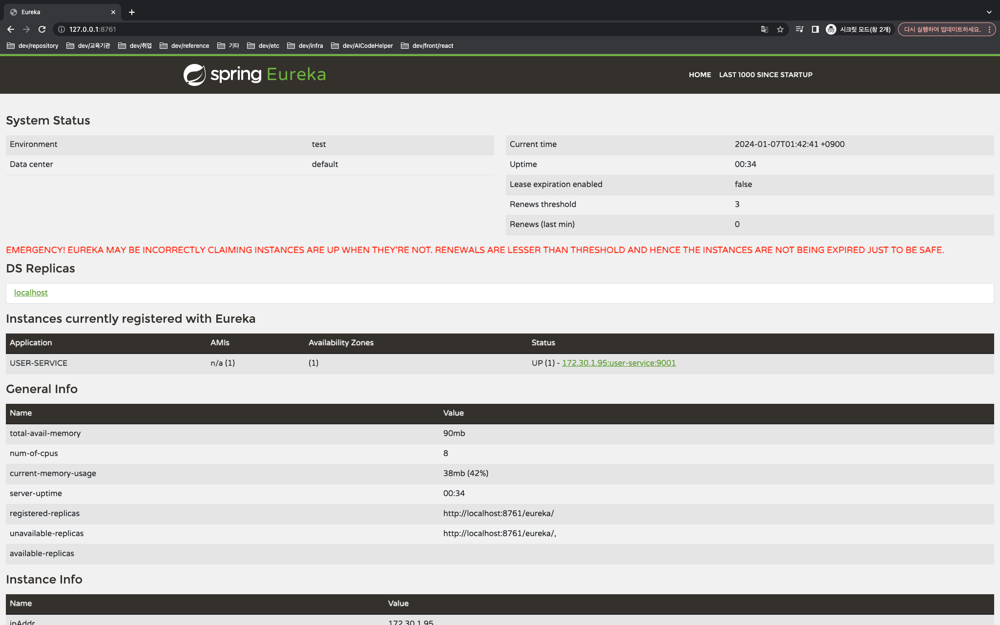
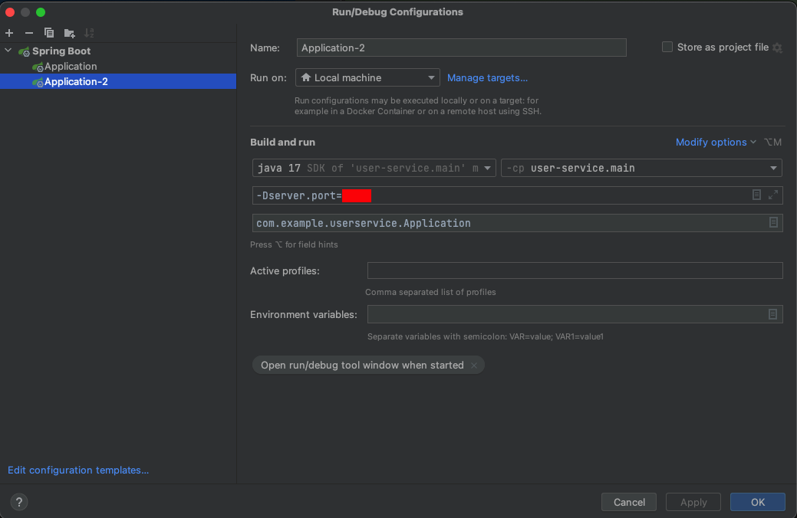
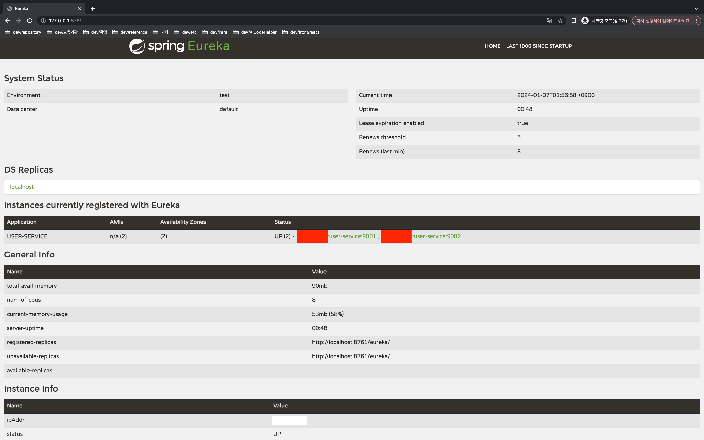
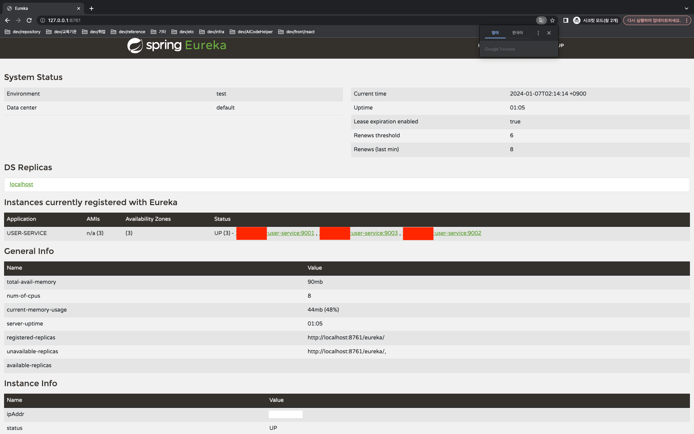
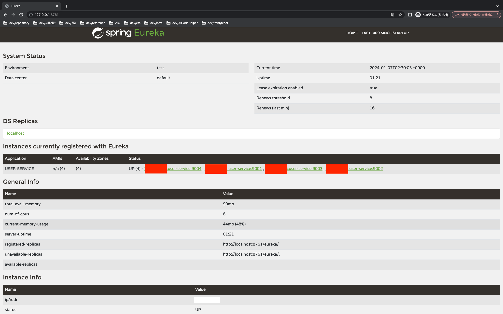

# user-service
* application.yml
```yaml
server:
  port: 9001

spring:
  application:
    name: user-service

eureka:
  client:
    register-with-eureka: #eureka 에 client 로 등록할지
    fetch-registry: #EUREKA 서버로부터 인스턴스들의 정보를 주기적으로 가져올 것인지를 설정하는 속성입니다. true 로 설정하면, 갱신된 정보를 받겠다는 설정입니다.
    service-url:
      defaultZone: #서버가 가지고 있는 위치값을 지정, 유레카라는 엔드포인트에 현재 우리가 가지고 있는 마이크로 서비스 정보를 등록하겠다.
```


## Discovery service - Client 기동
1. run discovery-service 
2. discovery dashboard 확인

3. run user-service
4. discovery dashboard 확인



## Multi client 기동-1(IDE)
1. edit configuration -> user-service 2 생성

2. run user-service 2 



## Multi client 기동-2(terminal)
1. project root directory 에서 terminal 로 아래 command 실행(run user-service 3)
```shell
./gradlew bootRun --args='--server.port=9003'
```



## Multi client 기동-3(terminal)
1. project root directory 에서 terminal 로 아래 command 실행(target 폴더 삭제)
```shell
./gradlew clean
```
2. jar 바이너리 파일 생성
```shell
./gradlew bootJar
```
3. /build/libs 디렉토리에 jar 파일 생성확인
4. run user-service 4
```shell
java -jar -Dserver.port=9004 ./build/libs/user-service-0.0.1-SNAPSHOT.jar
```
