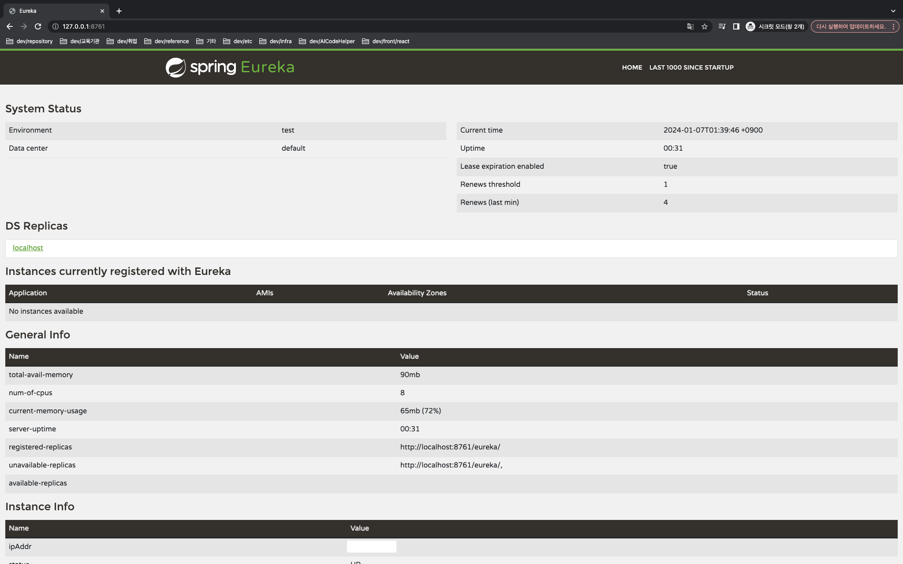
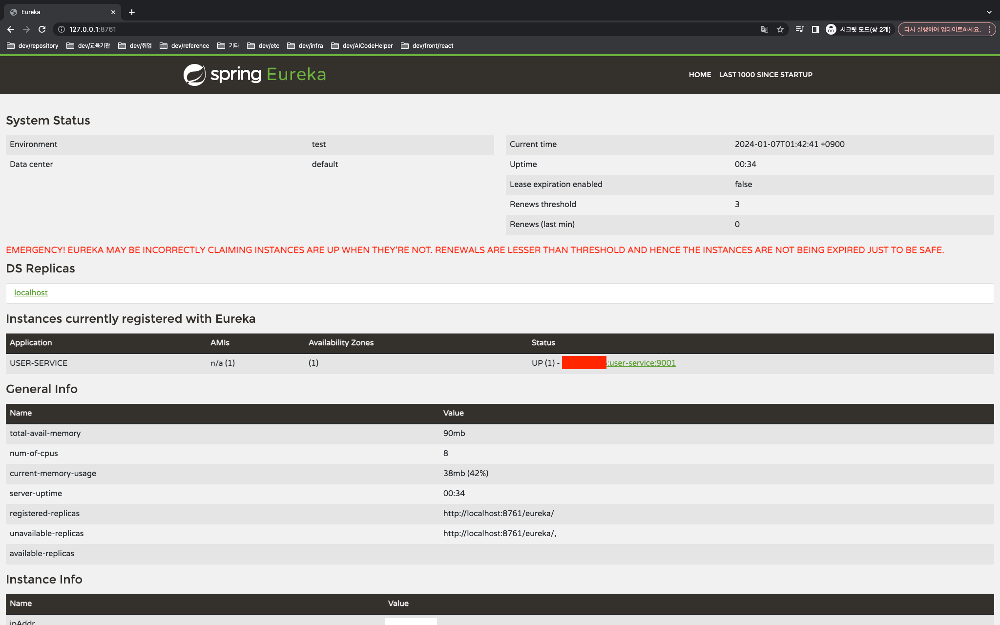

# user-service
* application.yml
```yaml
server:
  port: 9001

spring:
  application:
    name: user-service

eureka:
  client:
    register-with-eureka: #eureka 에 client 로 등록할지
    fetch-registry: #EUREKA 서버로부터 인스턴스들의 정보를 주기적으로 가져올 것인지를 설정하는 속성입니다. true 로 설정하면, 갱신된 정보를 받겠다는 설정입니다.
    service-url:
      defaultZone: #서버가 가지고 있는 위치값을 지정, 유레카라는 엔드포인트에 현재 우리가 가지고 있는 마이크로 서비스 정보를 등록하겠다.
```
1. run discovery-service 
2. discovery dashboard 확인

3. run discovery-service
4. discovery dashboard 확인
